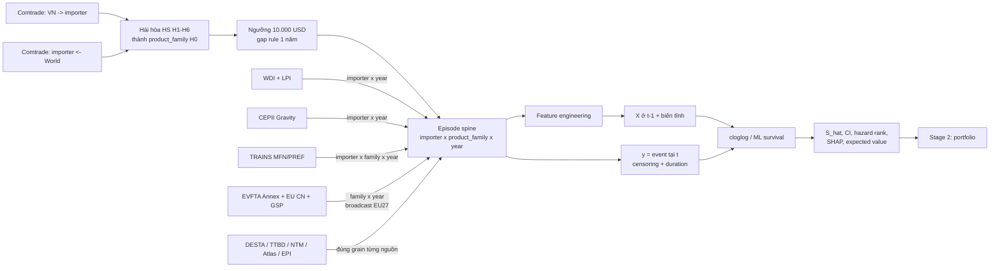

# Cách trình bày các nhóm feature trong `stage1_panel`

**Mục đích:** tài liệu nói chuyện với giảng viên về dataframe chính
`data/final/stage1_panel.parquet`: dữ liệu gồm những khối nào, lấy từ đâu,
được nối vào nhau ra sao, vì sao phải nối, cột nào là input, cột nào là
outcome/output, và nên trực quan hóa những gì.

**Căn cứ:**

- [Stage1_Research_Framework.md](../Stage1_Research_Framework.md) — logic nghiên cứu B0–B9;
- [TU_DIEN_DU_LIEU_FINAL_DF.md](TU_DIEN_DU_LIEU_FINAL_DF.md) — định nghĩa 205 cột;
- `scripts/build_spells.py`, `scripts/merge_panel.py`, `scripts/build_stage1_df.py` — cách file hiện tại thực sự được dựng;
- kiểm tra trực tiếp `data/final/stage1_panel.parquet` ngày 04/09/2026.

---

## 1. Thông điệp nên nói trước tiên

Không nên giới thiệu đây là “một file có 205 feature”. Cách nói chính xác hơn
là:

> Đây là một **person-period survival panel**. Mỗi dòng là một năm trong vòng
> đời của một quan hệ xuất khẩu Việt Nam → thị trường nhập khẩu × nhóm sản
> phẩm. Trên cùng một trục quan hệ–năm, nhóm ghép bốn lớp input chính: sức khỏe
> quan hệ, điều kiện thị trường, chính sách thuế và cấu trúc danh mục. Outcome
> quan sát là quan hệ có chấm dứt hay không; output cuối Stage 1 sẽ là xác suất
> sống sót dự báo của từng quan hệ.

Ba ý phải tách rõ:

1. **205 cột không đồng nghĩa 205 biến đầu vào.** Trong đó có khóa, nhãn
   survival, biến gốc dùng để tính feature, cờ chất lượng, feature bổ sung cho
   robustness, và các nhánh ngoài scope EU.
2. **Input chính phải là trạng thái ở `t−1`.** Outcome là `event` tại năm `t`;
   không đưa giá trị cùng năm của quan hệ vào mô hình hazard chính.
3. **File hiện tại chưa chứa output B9.** Các cột `S_hat`, `S_hat_lo`,
   `S_hat_hi`, `value_expected`, `hazard_rank`, `shap_top3` chỉ xuất hiện sau
   khi chạy B5–B7.

### Câu nói một phút

“Bảng chính có 949.537 dòng và 205 cột, nhưng mô hình không dùng cả 205 cột.
Đầu tiên, dữ liệu Comtrade tạo xương sống quan hệ thị trường–sản phẩm–năm và
nhãn sống/chết. Sau đó nhóm nối bốn khối input: hiệu năng của chính quan hệ,
quy mô/cầu của thị trường, thuế–EVFTA, và độ dày của danh mục. Các nguồn bổ
sung như NTM, logistics xanh, complexity và trade remedies chỉ dùng cho
robustness. Mô hình học `event` từ thông tin `t−1`, rồi trả ra hazard và xác
suất sống sót cho từng quan hệ để bàn giao sang Stage 2.”

---

## 2. Scope thực tế của file và scope nên trình bày

### 2.1. Master file và mẫu chính là hai thứ khác nhau

| Tầng dữ liệu | Phạm vi | Số liệu kiểm tra trực tiếp | Vai trò |
|---|---|---:|---|
| Master | 147 importer, 2002–2025 | 949.537 dòng; 194.461 spell; 4.637 `product_family` | Kho dữ liệu chung và robustness B8 |
| EU27, 2012–2024, gồm năm đệm | EU27 hiện tại, cửa sổ B0 | 155.461 dòng | Dùng để dựng đúng spell và thời gian |
| **Mẫu mô tả chính** | EU27, 2012–2024, `gap_filled == 0` | **148.475 episode-năm; 32.361 spell; 3.168 family; 18.516 event** | Con số nên báo cáo với thầy |

`gap_filled == 1` có 6.986 dòng trong cửa sổ EU27 2012–2024. Đó là năm dưới
ngưỡng được giữ để nối spell theo gap rule một năm, không phải một quan hệ
đang hoạt động đủ ngưỡng. Khi báo cáo số episode đang sống hoặc tỷ lệ event,
phải loại các dòng này. Việc giữ hay bỏ chúng khỏi risk set khi ước lượng
discrete-time hazard cần được khóa thành một quyết định mô hình riêng và ghi
rõ, vì bỏ chúng làm trục thời gian có khoảng trống còn giữ chúng lại coi năm
đệm là một năm sống theo quy tắc làm mượt.

### 2.2. Bốn khác biệt giữa framework và file thực tế phải nói thẳng

| Framework B0/B1 | File hiện tại | Cách trình bày |
|---|---|---|
| BACI là nguồn thương mại chính | **UN Comtrade, số liệu do importer khai** | Gọi đúng là importer-reported Comtrade; BACI vẫn là lựa chọn phương pháp chưa chốt |
| HS2012 thuần | `product_family` neo về H0, nối H1–H6 qua WITS concordance | Giải thích đây là cách giữ một sản phẩm nhất quán qua 2002–2025; không gọi nó là HS2012 thuần |
| Full grid gồm cả ô 0 | File cuối chỉ có các năm thuộc một spell, cộng năm đệm | Phù hợp phân tích survival của quan hệ đã xuất hiện; **chưa đủ candidate universe cho bài toán entry** |
| Khung dữ liệu chính 2012–2024 | Master giữ 2002–2025 | Dữ liệu ngoài cửa sổ dùng đo tuổi trước 2012, xác định event/censor ở biên và làm robustness |

Điểm này không làm mất giá trị của dataset, nhưng thay đổi tên nguồn, khóa sản
phẩm và phạm vi kết luận. Không nên trình bày theo mô tả dự kiến trong framework
nếu code và file đã đi theo thiết kế khác.

---

## 3. Sơ đồ từ raw tới input và output



Xương sống của mọi phép ghép là `(importer, product_family, year)`, nhưng
không phải nguồn nào cũng có đủ ba chiều. Biến ở grain thô hơn được broadcast
có chủ đích:

| Grain thật của biến | Ví dụ | Khóa ghép vào episode | Vì sao đúng |
|---|---|---|---|
| Quan hệ × năm | value, market share, unit value, thuế importer | `importer + product_family + year` | Mỗi thị trường–sản phẩm có giá trị riêng |
| Importer × năm | GDP, dân số, LPI, số sản phẩm đang mua | `importer + year` | Cùng một điều kiện thị trường áp cho mọi sản phẩm vào nước đó |
| Product family × năm | RCA của Việt Nam, tăng trưởng sản phẩm, chính sách EU-wide | `product_family + year` | Vị thế sản phẩm hoặc biểu thuế chung không phụ thuộc importer EU nào |
| Importer × HS2 × năm | `hs2_share` | `importer + hs2 + year` | Đo cụm ngành trong danh mục riêng của từng thị trường |
| Năm | HHI toàn danh mục, GEPU, giá hàng hóa | `year` | Sốc chung được broadcast lên mọi quan hệ |
| Importer tĩnh | distance, language, colonial ties | `importer` hoặc bản lặp theo `importer + year` | Việt Nam là exporter cố định; khoảng cách không đổi theo sản phẩm/năm |

**Quy tắc lag:** lag bằng join đúng năm lịch `year−1`, không dùng `.shift(1)`.
Một quan hệ có thể có nhiều spell hoặc có khoảng trống; row shift có thể kéo
nhầm dữ liệu từ một spell cũ.

---

## 4. Phân biệt khóa, outcome, input và output

| Vai trò | Cột | Có đưa vào ma trận X? | Cách dùng |
|---|---|---|---|
| Khóa | `importer`, `exporter`, `product_family`, `hs2`, `year`, `spell_id` | Không | Định danh, group, join, split theo thời gian |
| Đồng hồ survival | `spell_start_year`, `spell_end_year`, `t_start`, `t_stop` | `t_stop` dùng để tạo duration dummies M0 | Mô tả tuổi và baseline hazard |
| Cơ chế quan sát | `right_censored`, `left_trunc`, `gap_filled` | Không phải explanatory feature | Xây risk set đúng; không coi censor là chết |
| **Outcome quan sát** | **`event`** | Đây là `y`, không phải `X` | 1 ở năm cuối còn sống nếu cái chết được quan sát; 0 nếu chưa chết/censored |
| Input | Các covariate `_lag`/`_lag1` và biến tĩnh được chọn | Có | Giải thích/dự báo hazard tại `t` bằng thông tin trước đó |
| Output mô hình | `h_hat`, `S_hat`, interval, coefficient/HR, SHAP | Chưa nằm trong file | Sinh ra ở B5–B7 |
| Output bàn giao B9 | `S_hat`, `S_hat_lo`, `S_hat_hi`, `value_expected`, `hazard_rank`, `shap_top3`, `staging_cat` | Không | Input duy nhất Stage 2 cần |

`right_censored = 1` được lặp trên các dòng của spell bị censor; nó không phải
nhãn “sống” để thay cho `event`. Với KM, phải co về **một dòng cuối mỗi
`spell_id`**, lấy duration cuối và trạng thái event cuối.

---

## 5. Bốn nhóm feature cốt lõi theo B3

### 5.1. Nhóm 1 — Sức khỏe và năng lực của quan hệ/sản phẩm

**Câu hỏi kinh tế:** quan hệ đã lớn, ổn định, có lợi thế và bám được thị trường
thì có ít rủi ro đứt gãy hơn không?

### Biến nên dùng

| Thành phần | Cột gốc/cùng năm | **Input chính tại `t−1`** | Nguồn và grain | Vai trò |
|---|---|---|---|---|
| Quy mô quan hệ | `import_value_usd`, `log_value` | **`log_value_lag`** | Comtrade VN → importer; quan hệ × năm | M1 core |
| Thị phần VN tại đúng thị trường–sản phẩm | `vn_market_share_pct` | **`vn_market_share_pct_lag1`** | Comtrade VN / Comtrade World; quan hệ × năm | M1 core |
| Đơn giá | `unit_value_usd_per_kg` | `unit_value_usd_per_kg_lag1` | Value / net weight; quan hệ × năm | Robustness vì quantity thiếu và đơn vị đo không đồng nhất hoàn toàn |
| Bất ổn gần đây | — | **`volatility_3y_lag1`** | SD của `ln(value+1)` ở t−3…t−1; quan hệ × năm | M1 core hoặc M1b |
| Lợi thế so sánh | `rca` | **`rca_lag`** | Comtrade VN và World; **product family × năm** | M1 core |
| Tăng trưởng xuất khẩu VN của sản phẩm | `country_growth_pct` | **`growth_lag_pct`** | Comtrade; product family × năm | M1 core |
| Tăng trưởng cầu thế giới của sản phẩm | `world_growth_pct` | `world_growth_pct_lag1` | Comtrade World; product family × năm | Control/robustness |

Các biến `product_share_pct`, `partner_share_pct`, `hhi_market`,
`hhi_product`, `net_weight_kg` và các bản cùng năm phù hợp cho mô tả hoặc làm
nguyên liệu tạo feature; không đưa thẳng vào specification chính khi đã có
biến lag tương ứng hoặc year fixed effects.

### Raw cùng nhóm được ghép như thế nào và vì sao

- `data/raw/trade/`: hàng Việt Nam do từng importer báo cáo, cho tử số value và
  quantity.
- `data/raw/trade_world/`: tổng nhập khẩu của cùng importer từ thế giới, cho
  mẫu số market share, RCA và biến cầu.
- `data/raw/concordance/H1_to_H0` … `H6_to_H0`: nối mã sản phẩm giữa các phiên
  bản HS thành một `product_family`. Nếu không nối, đổi mã HS sẽ bị hiểu sai là
  một quan hệ cũ chết và một quan hệ mới sinh.
- Hai luồng Comtrade phải dùng **cùng một hàm family mapping** trước khi chia
  tỷ lệ. Đây là điều kiện để tử số và mẫu số nói về cùng sản phẩm.

### Input và output của nhóm

- **Input X:** năm biến in đậm ở bảng trên; unit value và world growth là bản
  mở rộng.
- **Outcome y:** không nằm trong nhóm; vẫn là `event`.
- **Output cần báo cáo:** hệ số/hazard ratio của quy mô, thị phần, RCA,
  volatility và growth; trong nhánh ML là SHAP contribution của từng biến cho
  từng quan hệ.

---

### 5.2. Nhóm 2 — Quy mô thị trường, cầu và gravity

**Câu hỏi kinh tế:** cùng một sản phẩm, quan hệ có bền hơn ở thị trường lớn,
giàu, có cầu mạnh và chi phí tiếp cận thấp không?

### Biến nên dùng

| Thành phần | **Input dự kiến** | Nguồn/grain | Ghi chú sử dụng |
|---|---|---|---|
| Quy mô thị trường | `log_gdp_d_lag1` | World Bank WDI; importer × năm | M2 core |
| Thu nhập/dân số | `log_gdpcap_d_lag1`, `log_pop_d_lag1` | WDI; importer × năm | Không nên đưa cả GDP, GDP/người và dân số vào một phương trình mà không kiểm tra đa cộng tuyến |
| Cầu của importer cho sản phẩm | `log_total_import_cp_lag1` | Comtrade World; **đúng ra là importer × family × năm** | **Chưa dùng cho tới khi sửa lỗi grain, xem §9.1** |
| Khoảng cách | tạo `log_dist = ln(dist)` từ `dist` | CEPII Gravity; importer tĩnh | M2 core khi không có importer FE |
| Liên kết lịch sử/thể chế | `col45` và biến gravity có variation phù hợp | CEPII Gravity | Tùy specification |
| Macro mở rộng | các cột importer inflation, exchange rate, trade openness bản `_lag1` | WDI; importer × năm | Robustness |

Trong mẫu EU27 hiện tại, `contig`, `comlang_off`, `comlang_ethno` và `comcol`
đều chỉ có một giá trị 0. Chúng không thể được ước lượng, dù framework ban đầu
liệt kê `contig` và `comlang_off`. `col45` còn variation và có thể dùng.

Các biến gravity bất biến theo thời gian như distance sẽ bị hấp thụ khi B6 có
importer fixed effects. Khi đó chúng vẫn có vai trò trong B5 không có importer
FE, nhưng không có hệ số riêng trong event-study B6.

### Raw cùng nhóm được ghép như thế nào và vì sao

- `macro_panel_v2.csv`, dựng từ World Bank WDI, ghép theo
  `(importer, year)`; exporter macro ghép theo `(VNM, year)`.
- LPI không phải chuỗi năm: lấy survey wave gần nhất ở quá khứ và giữ
  `importer_lpi_source_year` để biết quan sát thật đến từ năm nào.
- `gravity_vn.csv`, dựng từ CEPII Gravity V202211, ghép theo
  `(importer, year)` vì exporter luôn là Việt Nam; 2022–2025 carry-forward và
  ghi `gravity_source_year`.
- Cầu sản phẩm từ Comtrade World phải ghép theo đúng
  `(importer, product_family, year)`, vì nhu cầu giày của Đức không thể dùng
  thay nhu cầu giày của Ba Lan.

### Input và output của nhóm

- **Input X:** GDP/quy mô thị trường, cầu sản phẩm, distance và các control đã
  chọn.
- **Outcome y:** `event`.
- **Output:** thay đổi hazard gắn với điều kiện thị trường; các biến này chủ
  yếu là controls để hệ số policy không hấp thụ chênh lệch về quy mô/cầu.

---

### 5.3. Nhóm 3 — Chính sách thuế và EVFTA

**Câu hỏi kinh tế:** giảm thuế theo EVFTA có làm giảm hazard, và tác động có
khác nhau theo lộ trình sản phẩm không?

### Phải tách hai khối thuế

| Khối | Cột | Dùng ở đâu | Lý do |
|---|---|---|---|
| Thuế generic 147 nước | `tariff_rate`, `tariff_type`, `tariff_source_year`, `tariff_reporter`, `tariff_rate_lag1` | B8 global robustness | Có sai số GSP EU trước 2020 và thiếu lịch TRAINS sau 2023; không dùng làm treatment chính EU |
| **Thuế EU hợp nhất** | `tariff_mfn_pct`, `tariff_applied_pct`, `tariff_applied_source`, `pref_margin_pp`, `staging_cat`, `staging_cat_slowest`, `staging_mixed`, `evfta_cut_cum_pp`, `evfta_cut_cum_share`, `years_since_evfta_policy` và năm bản lag | **M3/B6 core** | Phản ánh GSP trước EVFTA và lộ trình EVFTA sau 2020 |

### Raw EU được ghép như thế nào

| Raw | Thông tin lấy | Chuẩn hóa | Vai trò trong applied tariff |
|---|---|---|---|
| EVFTA Annex 2-A Appendix 2-A-1 | CN8, base rate, staging category | CN8 → HS6 H4 → cùng `product_family` H0 | Lộ trình EVFTA 2020–2035 |
| TRAINS MFN | MFN EU 2002–2023 | HS revision → family | Thuế trần và đối chứng lịch sử |
| EU Common Nomenclature, EUR-Lex | MFN 2024–2026 | CN8/HS6 → family | Lấp phần TRAINS chưa có |
| TRAINS GSP group | GSP 2000–2014, carry đến 2019 | HS → family | Thuế Việt Nam được hưởng trước EVFTA |

Quy tắc hợp nhất:

```text
năm <= 2019: applied = GSP nếu có, nếu không dùng MFN
năm >= 2020: applied = min(EVFTA schedule, MFN)
pref_margin_pp = MFN - applied
```

Sau đó bảng `eu_tariff_panel.csv`, grain `(product_family, year)`, được
broadcast cho 27 importer EU vì họ dùng cùng biểu thuế quan chung và cùng cam
kết EVFTA. Không ghép một schedule quốc gia riêng cho từng thành viên EU.

### Input chính cho từng bài toán

- **M3 hazard:** `tariff_applied_lag`; có thể báo thêm
  `tariff_mfn_pct_lag1`, nhưng không đưa một cách máy móc các thành phần phụ
  thuộc tuyến tính vào cùng specification.
- **B6 identification:** `pref_margin_lag × post_2020`, year FE, importer FE,
  HS2 FE và duration controls. `post_2020` phải tạo từ `year >= 2020`.
- **Cắt lát:** `staging_cat`; với family gộp nhiều CN8, chạy robustness bằng
  `staging_cat_slowest` và cờ `staging_mixed`.
- **Cường độ tích lũy/counterfactual:** `evfta_cut_cum_pp_lag` hoặc
  `evfta_cut_cum_share_lag`, chọn một thước đo mỗi specification.
- `years_since_evfta_policy` không có hệ số riêng khi đã dùng đầy đủ year FE;
  nó dùng để tạo event-time indicators.
- `TRQ` và `A+EP` không phải một lộ trình ad-valorem thông thường; tách riêng
  hoặc loại khỏi mẫu treatment chính.

Trên đúng mẫu mô tả EU27 2012–2024 của file hiện tại:

| Staging | Episode-năm | Tỷ trọng episode | Tỷ trọng kim ngạch cộng dồn |
|---|---:|---:|---:|
| A | 116.096 | 78,19% | 80,31% |
| B5 | 14.171 | 9,54% | 8,27% |
| B3 | 9.217 | 6,21% | 4,94% |
| B7 | 6.729 | 4,53% | 6,06% |
| TRQ | 850 | 0,57% | 0,22% |
| A+EP | 63 | 0,04% | 0,03% |
| Không map được | 1.349 | 0,91% | 0,16% |

Ba nhóm cắt dần B3/B5/B7 chiếm 20,28% episode và 19,28% kim ngạch cộng dồn
trong cửa sổ này. Đây là phần tạo variation treatment giữa sản phẩm.

### Input và output của nhóm

- **Input X/treatment:** applied tariff, preference margin, staging/cumulative
  cut theo đặc tả trên.
- **Outcome y:** `event`.
- **Output B5:** hệ số/hazard ratio của thuế.
- **Output B6:** các hệ số event-study `delta_k`, kiểm định pre-trend, placebo
  2017 và heterogeneity theo tuổi/quy mô/ngành. Chỉ sau identification mới gọi
  đây là bằng chứng tác động; hazard association đơn thuần chưa phải causal.

---

### 5.4. Nhóm 4 — Cấu trúc danh mục và economies of scope

**Câu hỏi kinh tế:** một quan hệ nằm trong cụm xuất khẩu dày có bền hơn vì tận
dụng được chi phí chìm, thông tin và mạng lưới phân phối chung không?

| Khái niệm | Cột cùng năm | **Input `t−1`** | Grain |
|---|---|---|---|
| Độ rộng sản phẩm tại một thị trường | `n_products_to_c` | **`n_products_to_c_lag1`** | importer × năm |
| Độ rộng thị trường của một sản phẩm | `n_markets_for_p` | **`n_markets_for_p_lag1`** | product family × năm |
| Độ dày cụm ngành trong một thị trường | `hs2_share` | **`hs2_share_lag1`** | importer × HS2 × năm |
| Tập trung toàn danh mục theo thị trường | `hhi_market` | Chỉ mô tả/Stage 2 | năm |
| Tập trung toàn danh mục theo sản phẩm | `hhi_product` | Chỉ mô tả/Stage 2 | năm |

Ba feature chính được tính chỉ trên quan hệ thật sự đạt ngưỡng
`gap_filled == 0`, rồi broadcast trở lại episode. Nhờ vậy một năm đệm dưới
ngưỡng không tự làm tăng số sản phẩm đang hoạt động.

`hhi_market` và `hhi_product` chỉ thay đổi theo năm. Trong mô hình có year FE,
chúng bị hấp thụ hoàn toàn; giữ chúng cho đồ thị danh mục, robustness không có
year FE hoặc Stage 2.

### Input và output của nhóm

- **Input X:** ba cột lag in đậm.
- **Outcome y:** `event`.
- **Output:** hệ số/SHAP cho cơ chế economies of scope; sau B9, các thước đo
  tập trung còn được dùng để đánh giá portfolio chứ không phải dự báo event.

---

## 6. Các module bổ sung: dùng có mục đích, không nhồi vào M3

| Module | Các cột hiện có | Nguồn và cách join | Vai trò khuyến nghị |
|---|---|---|---|
| FTA | `fta_in_force`, `n_agreements`, `first_fta_year`, `years_since_fta`, `gstp_in_force`, `any_agreement_in_force`, `fta_names` | DESTA, importer × năm | Control/robustness; không thay thế mức thuế thực |
| NTM HS6 × năm | `ntm6_*_survey`, `ntm6_*_inforce`, `ntm6_source_year`, `ntm6_observed` | TRAINS researcher; reporter × H4 HS6 → family × survey/in-force year; EU dùng reporter EUN | **Module NTM ưu tiên** cho B5/B7; phải dùng source/observed flags |
| NTM sector snapshot | `ntm_coverage_ratio`, `ntm_frequency_ratio`, các coverage SPS/TBT/quantity/technical/nontechnical, `ntm_n_types`, `ntm_survey_year`, `ntm_sector` | WITS public; importer/EUN × 16 sector, broadcast qua năm | Fallback; không trộn với NTM6 như cùng một khái niệm |
| NTM AVE | `ntm_ave_border_pct`, `ntm_ave_border_simple_pct`, `ntm_ave_n_sectors`, `ntm_ave_source_year` | UNCTAD–GTAP 11, importer-year từ lát cắt 2017 | Robustness; variation thời gian hạn chế |
| LPI | `importer_lpi_overall` và 6 cấu phần, `importer_lpi_source_year` | World Bank LPI wave, importer × wave gần nhất ở quá khứ | Robustness về logistics |
| GLPI | bốn cột `importer_glpi_*` | LPI + Yale EPI, importer × LPI wave | Chọn **một** construction chính; không đưa cả bốn |
| Complexity | `pci`, `pci_source_year`, `product_hs4`, `importer_eci`, `importer_coi`, `importer_diversity`, `exporter_eci` | Atlas; PCI family/HS4 × năm, ECI importer × năm | Product/market heterogeneity; kiểm tra collinearity với FE |
| Trade remedies | `ad_*`, `cvd_*`, `sg_*`, `ttb_any_in_force`, `ttbd_observed` | TTBD, importer × năm | Robustness; dữ liệu initiation chỉ tin cậy đến 2015 |
| Common shocks | `gepu_current`, `gepu_months`, `cmo_all_commodities`, 15 chỉ số `price_*` | GEPU + World Bank Pink Sheet, year | Mô hình không có year FE hoặc phân tích shock; bị year FE hấp thụ |
| Exporter macro | các cột `exporter_*` | WDI của Việt Nam, year | Không có variation giữa quan hệ trong cùng năm; bị year FE hấp thụ |
| CBAM | `cbam_*` | EU Regulation 2023/956, family × EU membership-year | Ngoài Stage 1 core; 2023–2025 mới là reporting, chưa phải carbon cost |
| Thuế Mỹ 2025 | `us_recip_*`, `us_transship_rate`, `us_recip_exempt_*` | HTS Ch.99/văn bản Mỹ, USA × family × 2025 | Ngoài mẫu EU27; bài/extension riêng |

Nguyên tắc trình bày: bốn nhóm B3 là thân bài; bảng trên là “module có sẵn để
kiểm tra độ vững hoặc mở rộng”, không phải lời hứa đưa tất cả vào một mô hình.

---

## 7. Model matrix đề xuất: cái gì thực sự đi vào M0–M3

| Model | `y` | `X`/controls | Output cần lấy |
|---|---|---|---|
| M0 | `event` | duration dummies từ `t_stop` | Baseline hazard theo tuổi |
| M1 | `event` | `log_value_lag`, `rca_lag`, `vn_market_share_pct_lag1`, `volatility_3y_lag1`, `growth_lag_pct` | Cơ chế cấp quan hệ/sản phẩm |
| M1s | `event` | M1 + ba biến structure lag | Kiểm tra economies of scope |
| M1b | `event` | M1s + unit value/world growth | Robustness của nhóm 1 |
| M2 | `event` | M1s + market size, demand, gravity phù hợp | Hệ số quan hệ/structure có bền sau controls? |
| M3 | `event` | M2 + `tariff_applied_lag` | Liên hệ giữa mức thuế và hazard |
| B6 event study | `event` | `pref_margin_lag × event-time`, duration controls, importer/HS2/year FE | `delta_k`, pre-trend, placebo, heterogeneity |
| B7 ML | event/time/censor | Bộ lag đã khóa + biến tĩnh; split 2012–2020 / 2021–2022 / 2023–2024 | C-index, td-AUC, IBS, calibrated `S_hat`, SHAP |

Trước khi ước lượng nên khóa hai phiên bản sample:

- **balanced-comparison sample:** cùng một complete-case sample cho M0–M3 để
  thay đổi hệ số không bị lẫn với thay đổi số quan sát;
- **maximum-information sample:** mỗi model dùng mọi dòng mà khối đó có thể
  dùng, báo riêng `N`.

Với một bộ core gồm value, RCA, market share, volatility, growth, GDP, dân số,
ba structure features và tariff applied, hiện có **109.206/148.475 = 73,55%**
dòng EU27 2012–2024 complete-case. Thiếu nhiều nhất là
`volatility_3y_lag1` (25,01%), market share lag (18,18%) và value lag
(16,86%); đây phần lớn là lịch sử chưa đủ ở đầu spell, không nên tự động điền
0.

---

## 8. Bản đồ đầy đủ 205 cột theo module

Mục này để trả lời nhanh khi thầy chỉ vào một cột và hỏi “nó thuộc nhóm nào”.

| Vị trí trong file | Số cột | Module |
|---:|---:|---|
| 1–13 | 13 | Khóa, spell, censoring, event |
| 14–25 | 12 | Trade, shares, RCA, demand, HHI, growth |
| 26–29 | 4 | Thuế generic TRAINS |
| 30–45 | 16 | Macro exporter/importer WDI |
| 46–53 | 8 | LPI |
| 54–57 | 4 | GLPI |
| 58–64 | 7 | FTA/agreements |
| 65–72 | 8 | Trade remedies |
| 73–93 | 21 | Gravity/thể chế/entry costs |
| 94–100 | 7 | Thuế Mỹ 2025 |
| 101–104 | 4 | NTM AVE |
| 105–122 | 18 | Common shocks/commodity prices |
| 123–129 | 7 | PCI/ECI/COI/diversity |
| 130–131 | 2 | Miễn trừ thuế Mỹ theo sản phẩm |
| 132–136 | 5 | CBAM |
| 137–146 | 10 | Thuế EU + EVFTA treatment |
| 147–159 | 13 | NTM cấp ngành |
| 160–171 | 12 | NTM HS6 × năm |
| 172–205 | 34 | B3 engineered features, lag đúng lịch và `hs2` |

Danh sách/định nghĩa từng cột nằm trong
[TU_DIEN_DU_LIEU_FINAL_DF.md](TU_DIEN_DU_LIEU_FINAL_DF.md); tài liệu này chỉ
quyết định vai trò nghiên cứu của chúng.

---

## 9. Các điểm phải xử lý trước khi gọi dataframe là “model-ready”

### 9.1. Lỗi grain của `log_total_import_cp_lag1` — ưu tiên sửa cao nhất

Theo định nghĩa, `total_import_cp_usd` là tổng nhập khẩu của **nước `c`** cho
sản phẩm `p`, nên grain đúng là `(importer, product_family, year)`. Tuy nhiên
`build_stage1_df.py` hiện đặt `log_total_import_cp` vào nhóm broadcast
`(product_family, year)` trước khi lag. Kết quả là cầu của một importer được
gán cho tất cả importer có cùng product–year.

Kiểm tra trực tiếp trên mẫu EU27 2012–2024:

- 126.481 dòng có cả giá trị lưu trong file và giá trị `t−1` đúng để đối chiếu;
- chỉ 2.527 dòng trùng;
- **123.954 dòng không trùng**;
- trong toàn bộ 24.138 nhóm product–year có dữ liệu, giá trị lag lưu trong file
  là hằng số giữa các importer.

**Kết luận:** chưa đưa `log_total_import_cp_lag1` vào M2/B7. Cần chuyển biến
này sang lookup relationship-level, rebuild file và chạy lại QC trước.

### 9.2. EU policy lag đúng giá trị nhưng mất coverage không cần thiết

Các giá trị `tariff_applied_lag` có thể đối chiếu đều khớp 100% với thuế EU
năm trước. Tuy nhiên feature lag hiện được dựng từ những product–year từng có
episode EU, thay vì nối trực tiếp từ `eu_tariff_panel.csv`, nên 2,60% dòng mẫu
chính bị null. Nên lag từ bảng policy đầy đủ để một sản phẩm mới xuất hiện vẫn
nhận được thuế năm trước — policy tồn tại trước quan hệ thương mại.

### 9.3. Một số cột framework yêu cầu phải tạo lúc lập model

- `log_dist`: chưa có, tạo từ `dist`;
- `post_2020` và event-time dummies: chưa có, tạo từ `year`;
- `tariff_imputed`: chưa có; tạo từ so sánh `tariff_source_year != year` cho
  khối generic, hoặc source flags tương ứng của bảng EU;
- duration dummies: tạo từ `t_stop`, không cần một cột `duration` lặp sẵn;
- `S_hat` và các output B9: chưa có vì mô hình chưa chạy.

### 9.4. Các bẫy specification

- `contig`, `comlang_off`, `comlang_ethno`, `comcol` không có variation trong
  mẫu EU27 này.
- Exporter macro, HHI và common shocks chỉ thay đổi theo năm, nên bị year FE
  hấp thụ.
- Distance và các đặc điểm importer tĩnh bị importer FE hấp thụ trong B6.
- Không đưa cả bốn GLPI vào cùng model.
- Không coi null ngoài EU của cột EVFTA/CBAM hay ngoài Mỹ của cột US tariff là
  số 0.
- Không coi `event=0` ở spell right-censored là một cái chết không xảy ra vĩnh
  viễn; đó chỉ là chưa quan sát thấy cái chết.
- Mẫu final là conditional on entry; chưa thể trả lời “nên gia nhập quan hệ
  chưa từng hoạt động nào” nếu chưa dựng full candidate grid.

### 9.5. Một câu trong từ điển dữ liệu cần cập nhật theo file hiện tại

Từ điển hiện nói category A chiếm khoảng 93% episode và kim ngạch EU27. Kiểm
tra trực tiếp trên file và scope B0 cho kết quả A = 78,19% episode và 80,31%
kim ngạch cộng dồn; B3/B5/B7 = 20,28% episode và 19,28% kim ngạch. Khi làm
slide phải lấy số từ file hiện tại và ghi rõ filter, không dùng tỷ lệ 93% nếu
chưa tái lập được cùng scope của con số cũ.

---

## 10. Kế hoạch visualization và dữ liệu cần trích xuất

### 10.1. Bộ hình tối thiểu để nói với thầy

| ID | Hình | Cần trích xuất/tính | Filter | Thông điệp | Trạng thái |
|---|---|---|---|---|---|
| **V1** | Sơ đồ nguồn → grain → episode → model output | Metadata nguồn và khóa join ở §3 | Không cần đọc value | Chứng minh việc ghép có logic, không phải gom 205 cột tùy ý | Làm ngay |
| **V2** | Funnel phạm vi dữ liệu | `len`, `n_unique(importer/product_family/spell_id)`, `sum(event)`, `sum(gap_filled)` | Full → EU27 → 2012–2024 → bỏ gap → complete core | Phân biệt master với mẫu mô hình | Làm ngay |
| **V3** | Timeline một quan hệ có nhiều spell/gap | `year`, `import_value_usd`, đường ngưỡng 10k, `spell_id`, `gap_filled`, `event`, `right_censored` | Chọn một cặp dễ hiểu, ví dụ DEU × `H0_620429` | Giải thích observation, spell, gap và event bằng một hình | Làm ngay |
| **V4** | Heatmap coverage feature theo năm | Với từng year và core column: `mean(is_not_null)`; thêm tỷ lệ `source_year == year` | EU27, 2012–2024 | Cho thấy khối nào thật sự sẵn sàng và missing nằm ở đâu | Làm ngay |
| **V5** | KM overall + 4–5 nhóm ngành | Co một dòng/spell: `duration=max(t_stop)`, `event=max(event)`; nhóm theo `hs2` | EU27 2012–2024; xử lý censor ở biên nhất quán | Chứng minh negative duration dependence và khác biệt ngành | Làm sau khi khóa risk-set rule |
| **V6** | Staging exposure: hai bar song song | Group `staging_cat`; đếm episode và tính `sum(import_value_usd)`/tổng | EU27, 2012–2024, bỏ gap | Cho thấy treatment không cân bằng và B3/B5/B7 tạo variation | Làm ngay |
| **V7** | Đường thuế theo staging và năm | Weighted mean của `tariff_applied_pct`, `pref_margin_pp`, `evfta_cut_cum_pp`; weight = `import_value_usd`; facet staging | EU27, 2012–2024; tách TRQ/A+EP | Trực quan cơ chế EVFTA thay vì chỉ nói dummy post-2020 | Làm ngay |

Chỉ V1, V2, V3, V5, V6/V7 là đủ cho một buổi trình bày ngắn. V4 để dự phòng
khi thầy hỏi chất lượng/missingness.

### 10.2. Hình sau khi có kết quả mô hình

| ID | Hình | Input cần có thêm | Cách dựng | Mục tiêu |
|---|---|---|---|---|
| **V8** | Baseline hazard theo duration | Kết quả M0 hoặc `sum(event)/risk set` theo `t_stop` | Line + CI | Kiểm tra hazard cao ở năm đầu rồi giảm |
| **V9** | Coefficient forest M0–M3 | coefficient, clustered SE, model name, N | Dot-whisker | Cho thấy hệ số ổn định ra sao khi thêm từng nhóm feature |
| **V10** | Event-study EVFTA | `k=year−2020`, `delta_k`, CI | Point-line, mốc k = −1 và 0 | Kiểm tra pre-trend và động học chính sách |
| **V11** | Calibration/AUC theo horizon | prediction trên test 2023–2024 | calibration curve + td-AUC/IBS | Chứng minh `S_hat` dùng được như xác suất, không chỉ ranking |
| **V12** | Portfolio quadrant | `import_value_usd` hoặc `value_expected`, `S_hat`, `hazard_rank`, `shap_top3` | Bubble/scatter: value × survival, màu theo HS2, facet market | Dịch kết quả Stage 1 thành Maintain/Expand/Reduce/Exit ở Stage 2 |

V12 chỉ được làm sau khi có prediction out-of-sample và calibration. Trước đó
không dùng `event` quan sát để giả làm risk score tương lai.

### 10.3. Đặc tả extract để người làm hình không hiểu sai

Mọi extract nên lưu kèm metadata:

```text
source_file       = data/final/stage1_panel.parquet
scope_importers   = fixed EU27 list hoặc membership-by-year, ghi rõ lựa chọn
year_window       = 2012-2024
gap_rule          = 1 year
gap_filter        = gap_filled == 0 hoặc quy tắc risk set đã khóa
unit              = episode-year / unique spell / USD, ghi riêng cho từng hình
generated_at      = ngày chạy
code_commit       = git commit hoặc checksum của parquet
```

Không dùng cùng một dataframe group-by cho cả episode chart và spell chart:

- episode chart đếm dòng;
- spell chart phải `group_by(spell_id)` trước;
- value chart phải nói là tổng value theo năm hay kim ngạch cộng dồn toàn cửa
  sổ;
- event-study chart lấy từ bảng hệ số mô hình, không lấy trực tiếp từ raw.

---

## 11. Gợi ý bố cục 7 slide / 7–10 phút

### Slide 1 — Câu hỏi và đơn vị phân tích

Một quan hệ = một thị trường nhập khẩu × một `product_family`; mục tiêu không
chỉ là kim ngạch mà là khả năng quan hệ tiếp tục sống.

**Hình:** một timeline quan hệ V3.

### Slide 2 — Xương sống dữ liệu

Comtrade importer-reported → harmonize HS → ngưỡng 10k → gap rule → spell và
episode.

**Hình:** phần trái của V1.

### Slide 3 — Bốn nhóm input

1. sức khỏe quan hệ/sản phẩm;
2. thị trường và gravity;
3. thuế/EVFTA;
4. cấu trúc danh mục.

Nói rõ tất cả covariate động dùng ở `t−1`.

**Hình:** phần giữa của V1, bốn khối màu.

### Slide 4 — Ghép vì sao hợp lý

Trình bày bảng grain: relationship-year, importer-year, product-year,
importer-HS2-year và year. Nhấn mạnh policy EU được broadcast vì là biểu thuế
chung; không phải vì thiếu dữ liệu quốc gia.

### Slide 5 — Outcome và output

`event` là outcome quan sát; censoring kiểm soát việc chưa nhìn thấy cái chết.
Output sau mô hình là `S_hat` và uncertainty, không phải thêm một biến thô.

**Hình:** KM V5 hoặc baseline hazard V8.

### Slide 6 — Identification EVFTA

Không dùng dummy post đơn giản; dùng khác biệt staging/preference margin giữa
sản phẩm trong cùng năm, với year FE để hút COVID và shock chung.

**Hình:** V6 + V7; sau khi chạy mô hình thay bằng V10.

### Slide 7 — Chất lượng, giới hạn và bước tiếp

- actual data khác framework ở Comtrade/product family;
- sửa demand lag grain;
- khóa gap/risk-set rule;
- chạy M0–M3, B6, B7;
- xuất B9 cho Stage 2.

Kết câu:

> Giá trị của dataframe không nằm ở 205 cột, mà ở việc nhiều nguồn khác grain
> đã được đưa về cùng một đơn vị kinh tế, để biến câu hỏi “xuất được bao nhiêu”
> thành “quan hệ nào có khả năng sống và vì sao”.

---

## 12. Checklist trước buổi gặp

- [ ] Dùng đúng tên nguồn: Comtrade importer-reported, không nói BACI nếu chưa
      đổi file.
- [ ] Dùng đúng khóa sản phẩm: `product_family` neo H0, không nói HS2012 thuần.
- [ ] Báo riêng master 147 nước và main sample EU27.
- [ ] Không gọi 205 cột là 205 model inputs.
- [ ] Nói rõ `event` là outcome; censoring không phải feature.
- [ ] Nói rõ output B9 chưa có và phải được model sinh ra.
- [ ] Không dùng `log_total_import_cp_lag1` trước khi sửa grain.
- [ ] Không hứa hệ số cho biến bị FE hấp thụ hoặc không có variation.
- [ ] Ghi filter và đơn vị ngay dưới mọi hình.
- [ ] Ưu tiên V1, V3, V5 và V6/V7; để V9–V12 sau khi mô hình hoàn thành.
