# Presentation material — data, preprocessing, problem shape, initial results

Material for next week's re-presentation. It follows the three requests from the
last meeting:

1. **Technique, shown on data:** how the data looks when raw, and how it looks after
   each processing step. Every step is captured as a CSV and drawn as a figure.
2. **Plots that characterise the problem.**
3. **Initial results only:** each model's score on each fold, plus the survival
   and hazard curves of all models side by side.

Everything here **reads** existing inputs and outputs: the Stage 1 panel,
`data/raw/`, the EU27 base table, `reports/batch2/cells.csv` and the saved test
predictions in `artifacts/runs/batch2/`. No model is refit and no benchmark report
is touched. All numbers match `reports/batch2/REPORT.md`.

## Rebuild

From `notebook/` (about 1 minute in total, 1–2 GB RAM):

```
PY=/home/minhquang/miniconda3/envs/srt-stage2/bin/python
$PY -m stage2_benchmark.presentation.step1_pipeline   # raw -> model input (captures, funnel, folds, preprocessing)
$PY -m stage2_benchmark.presentation.step2_problem    # descriptive plots of the problem
$PY -m stage2_benchmark.presentation.step3_results    # per-fold results, survival & hazard curves
```

Outputs go to `out/figures/` (PNG), `out/captures/` (the worked example at every
stage) and `out/tables/` (the numbers behind each figure). Step 3 needs
`artifacts/runs/batch2/`, which git does not track. It exists only on the machine
that ran Đợt 2.

---

## Part 1 — From raw customs data to model input

### 1.1 One relationship followed through every step

The worked example is **Austria importing from Viet Nam, product family
`H0_080110`** (coconuts, and the codes that later HS revisions split them into).
This one relationship shows every rule of the pipeline: an HS-revision change, the
USD 10,000 threshold, a bridged gap year, two confirmed exits, a re-entry,
left-truncation and right-censoring.

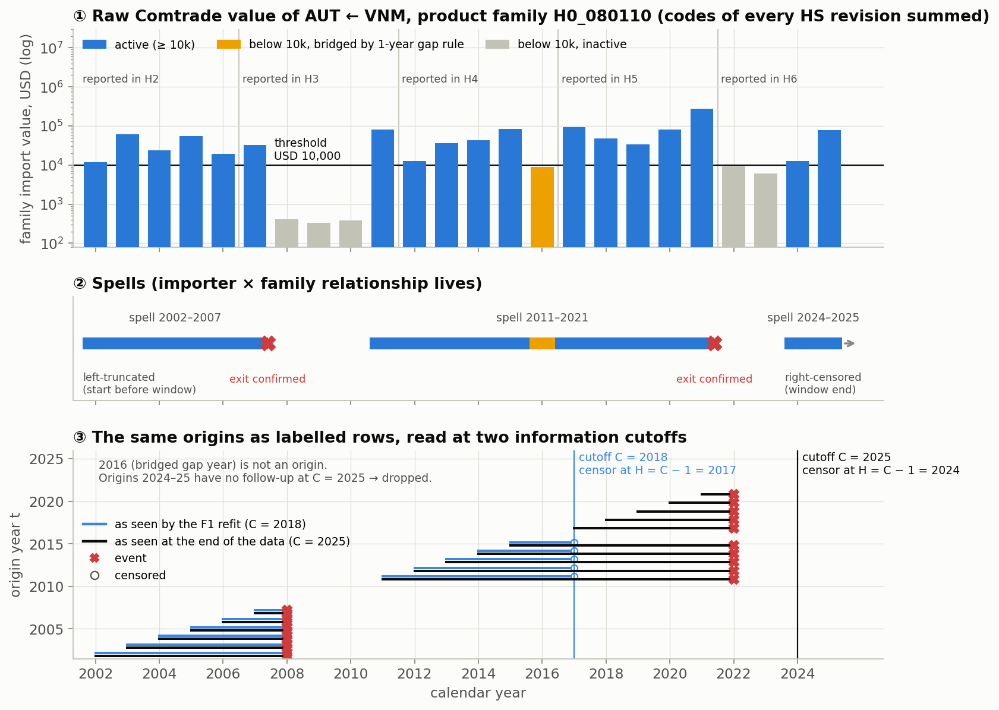

| # | Stage | What happens | Rule | Capture |
|---|---|---|---|---|
| 1 | Raw Comtrade | Importer-reported CIF lines, one row per HS6 code × year, in whatever HS revision Austria filed that year (H2 in 2002–06 … H6 from 2022) | exporter = VNM only; an importer-year counts as *observed* only if its HS6 file exists and covers ≥ 50% of its total imports from VN | `01_raw_comtrade_rows.csv` |
| 2 | Product family | Codes that are split or merged across revisions are unioned into one family key. For example, H2 `080111`, H4 `080111+080112+080119` and H6 `080111+080112+080119` all map to `H0_080110`. Values are summed per year | without this, a renumbered code looks like one death plus one birth | `02_family_year_series.csv` |
| 3 | Active year | A year is active when the family value is ≥ USD 10,000 (the WITS Trade Outcomes cut-off) | 2008–10 (USD 333–413) and 2022–23 (USD 6–9k) are inactive | same |
| 4 | Spell | Consecutive active years form a spell. **One** sub-threshold year between two active years is bridged: 2016 (USD 9,012) does not break the 2011–2021 spell | gap tolerance g = 1 (Besedeš–Prusa) | `03_panel_spell_years.csv`, `04_spells.csv` |
| 5 | Exit / censoring | A spell ending in year E is a confirmed exit only if E+1 and E+2 were both **observed** and below the threshold. Otherwise it is right-censored (end of window, importer stopped filing, or HS switch). A spell whose first year is the importer's first filed year has an unknown true start: `left_trunc = 1` | 2007 and 2021 are confirmed exits; the 2024–25 spell is censored; the 2002 spell is left-truncated | `04_spells.csv` |
| 6 | Base table (origins) | One row per **active** spell-year (the prediction origin t). Each row carries features known at the end of year t and the outcome facts kept apart as `_y_E`, `_y_died`. Bridged gap years are **not** origins | prefix-safe: nothing dated after t | `05_base_table_rows.csv` |
| 7 | Label at a cutoff | For an information cutoff C, every spell is censored administratively at H = C − g. `duration` and `event` are re-read as knowable at C. **D** label: y = 1{exit in the next year}. **L** label: (remaining duration, event) | the same origin gets a different label at different cutoffs; unconfirmable outcomes are dropped, never scored as 0 | `06_labels_by_cutoff.csv` |
| 8 | Model input | Fold-fitted preprocessor: median imputation + missing indicators + standardisation, all fitted on the training rows only; constant/duplicate columns dropped | 27 S6 columns → 35 model columns in fold F1 (12 indicators added, 4 dropped) | `07_features_raw_to_model_input.csv`, `08_model_matrix_rows.csv` |

Panel ③ of the figure is the core of the censoring technique. Take origin 2015 of
the 2011–2021 spell:

- **At C = 2018** (what the F1 refit may know), the row is *censored at duration 2*.
  The relation is alive through H = 2017 and nothing later can be read.
- **At C = 2025** the same row is an *event at duration 7*. The 2021 exit is now
  confirmed by the empty years 2022–23.

Censoring every row at the same H is what keeps censoring independent of the
outcome. See `reports/stage0/0.5_adapter_reproduction.md` for why the legacy rule
was replaced.

`07_features_raw_to_model_input.csv` shows the F1 test row (origin 2019) of this
relation, column by column: the raw value, the value after imputation, and the
standardised number the model receives. `evfta_cut_cum_pp_lag` is **dropped** in
fold F1 because it is 0 on every training origin. This is why block P cannot
measure EVFTA in the forecasting folds.

### 1.2 The whole EU27 sample

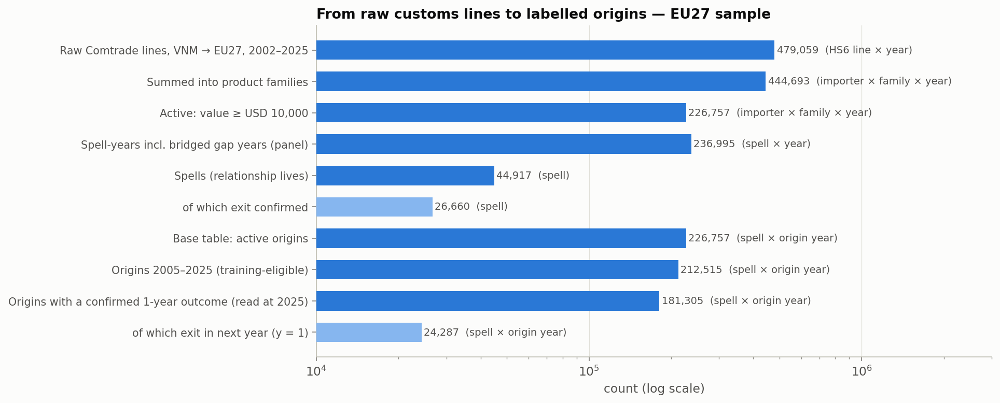

| Stage | Unit | Count |
|---|---|---:|
| Raw Comtrade lines, VN → EU27, 2002–2025 | HS6 line × year | 479,059 |
| Summed into product families | importer × family × year | 444,693 |
| Active (≥ USD 10,000) | importer × family × year | 226,757 |
| Spell-years incl. bridged gap years | spell × year | 236,995 |
| Spells | spell | 44,917 (26,660 confirmed exits) |
| Base table: active origins | spell × origin | 226,757 |
| Origins with a confirmed one-year outcome (2005–2023, read at 2025) | spell × origin | 181,305 (24,287 exits) |

Two identities serve as checks. Active importer-family-years equal base-table rows
(226,757). Summing the raw lines of the worked example reproduces the panel's value
to the cent in every year.

### 1.3 Temporal folds

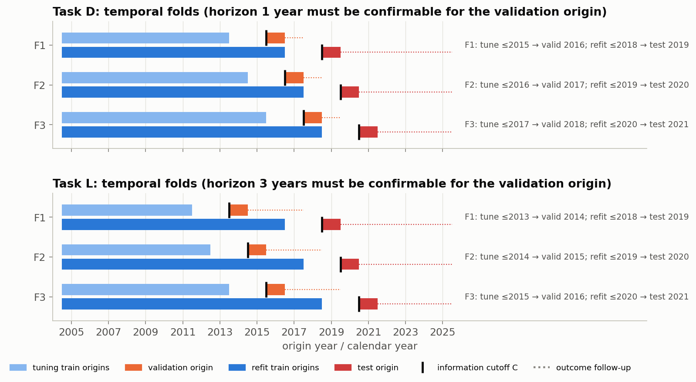

Each fold uses two stages. Tuning trains on origins up to C − 2 and scores one
validation origin. The refit trains up to its own cutoff and scores the test
origin, which is read to the end of the data. Task L needs the validation origin's
3-year horizon to be confirmable, so its tuning cutoff sits two years earlier than
Task D's. Sizes are in `out/tables/fold_sizes.csv`:

| Task · fold | Refit train origins | Train rows | Test origin | Test rows | Test events |
|---|---|---:|---|---:|---:|
| D · F1 | 2005–2016 | 95,514 | 2019 | 11,436 | 1,372 (12.0%) |
| D · F2 | 2005–2017 | 106,038 | 2020 | 11,706 | 1,164 (9.9%) |
| D · F3 | 2005–2018 | 117,147 | 2021 | 12,912 | 1,446 (11.2%) |
| L · F1 | 2005–2016 | 95,514 | 2019 | 11,436 | 2,836 within ≤ 5 y |
| L · F2 | 2005–2017 | 106,038 | 2020 | 11,706 | 2,426 within ≤ 4 y |
| L · F3 | 2005–2018 | 117,147 | 2021 | 12,912 | 2,528 within ≤ 3 y |

D and L score exactly the same test cohort in each fold. Only the label differs.

### 1.4 Features before and after preprocessing

`out/tables/feature_dictionary.csv` lists every feature with its block, grain,
transform, data type, missing semantics and missing share.

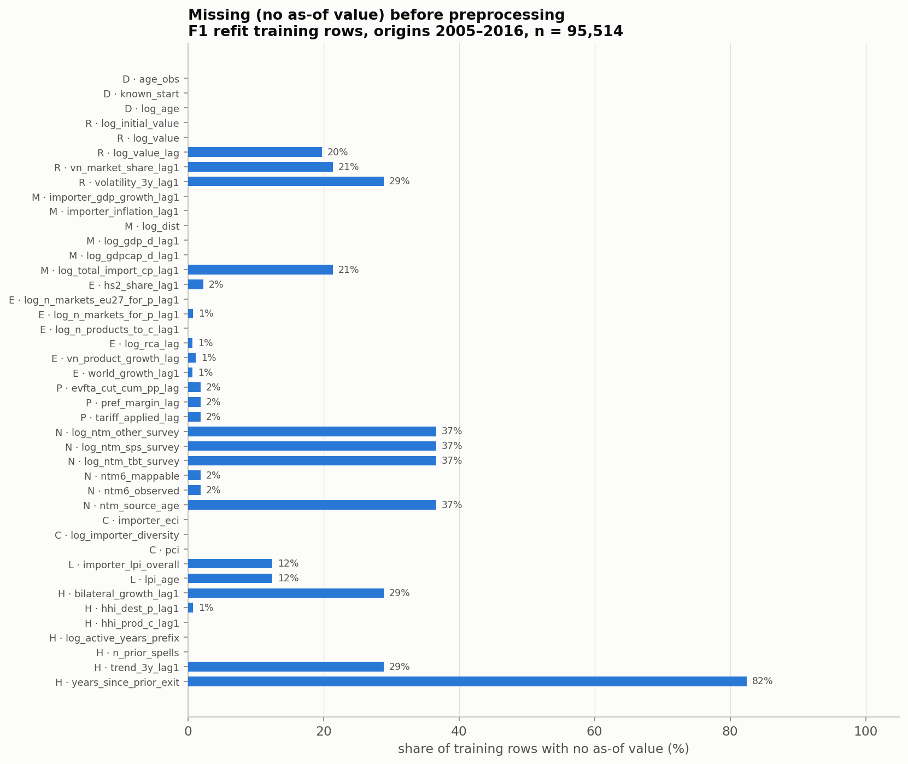

Missing means **"no as-of value"**, not zero. Three sources:

- lags on a relation's first year (`log_value_lag`, `vn_market_share_lag1` ≈ 20%);
- 3-year windows not yet filled (`volatility_3y_lag1`, `trend_3y_lag1` ≈ 29%);
- surveys that do not cover the importer-year yet (NTM ≈ 37%, LPI ≈ 12%).

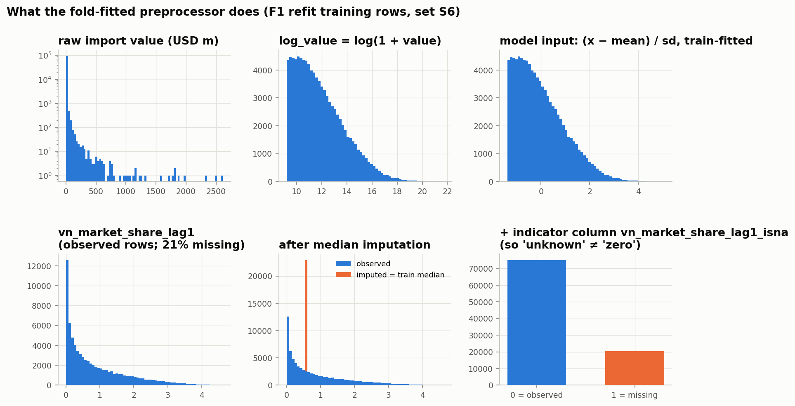

- **Top row:** the value is log-transformed when the base table is built, then
  standardised with the training mean and SD.
- **Bottom row:** a missing value becomes the training median, and a `_isna`
  indicator column records that it was unknown. The model can therefore tell
  "unknown" from "typical".

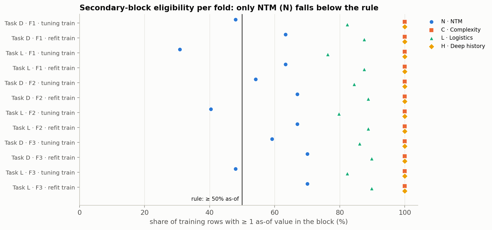

A secondary block (N, C, L, H) enters a fold only if at least 50% of training rows
have one of its key columns observed. NTM fails this rule in 4 of the 6 tuning
folds, including all three Task L tuning folds (30.8%, 40.4% and 47.9% in
F1/F2/F3; 40.4% in the F2 screening fold). This is why S5/S8 are ineligible for
Task L. The other blocks clear the rule everywhere.

---

## Part 2 — The shape of the problem

Numbers are in `out/tables/`. The spell-level curves use each spell's **first
origin**, re-censored with the benchmark rule at C = 2025. Plain `spells.csv`
lengths would count a spell that started in 2025 as a survivor of its first year,
although that exit cannot yet be confirmed.

| Figure | What it shows | Reading |
|---|---|---|
| 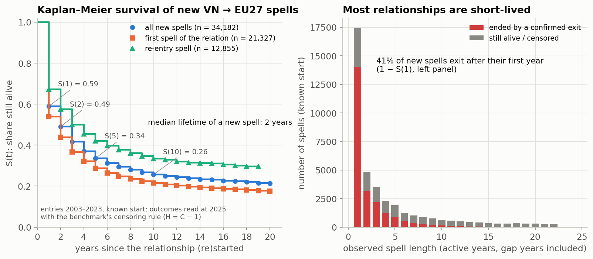 | Kaplan–Meier survival of new spells; observed spell lengths | **41% of new relationships die after their first year.** S(1) = 0.59, S(2) = 0.49, S(5) = 0.34, S(10) = 0.26, median lifetime 2 years. A long flat tail: relationships that survive the first years tend to last. |
| 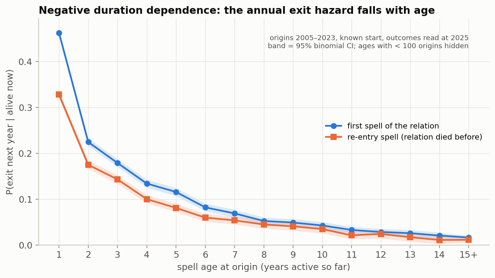 | Annual exit hazard by spell age | **Negative duration dependence.** The hazard falls from 0.46 at age 1 to 0.13 at age 4 and below 0.05 after age 9. Re-entry spells (the relation died before) are *less* risky than first spells at every age (0.33 vs 0.46 at age 1). This is the reason `age_obs` is the reference model for Task D. |
| 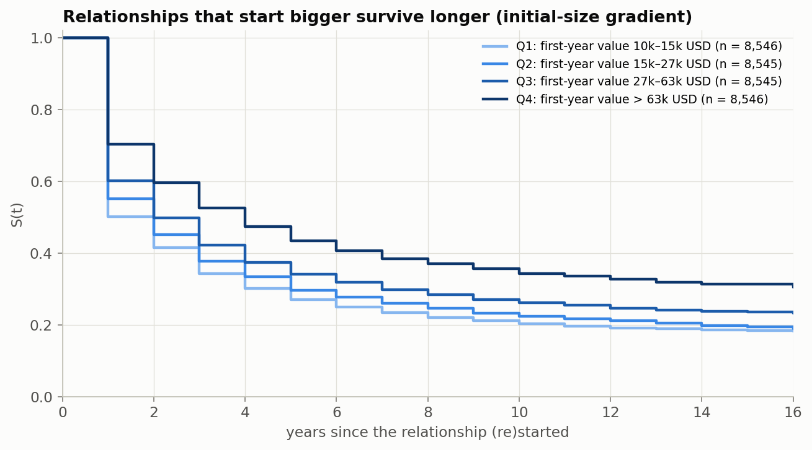 | Survival by first-year value quartile | **Initial-size gradient.** S(1) rises from 0.50 (smallest quartile) to 0.70 (largest); S(5) from 0.27 to 0.43. |
| 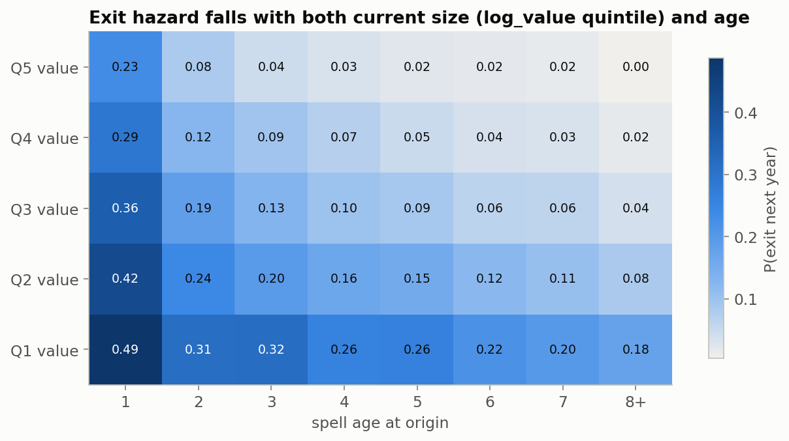 | Hazard by current value quintile × age | Size and age act together. The smallest-value young relations exit at 0.49 per year; the largest, aged 8+, at ~0.00. Block R (relationship strength) plus age carries most of the signal, as LOBO later confirms. |
| 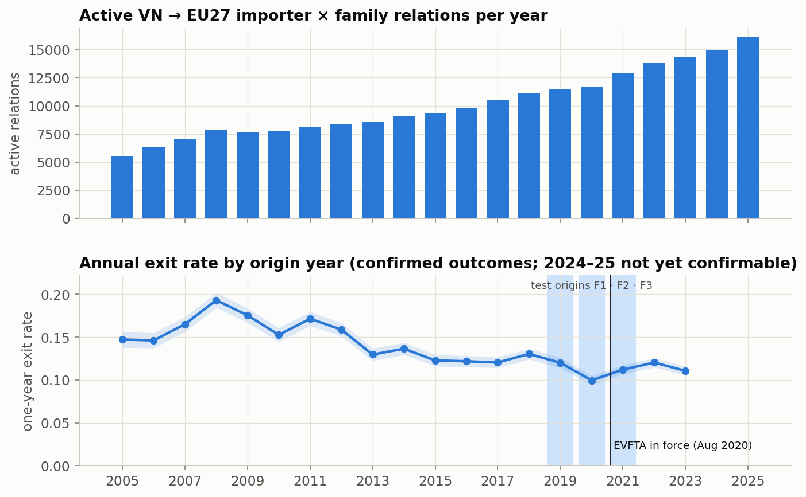 | Active relations and the exit rate by origin year | Active relations triple (5.6k → 16.1k) while the exit rate drifts down (0.19 in 2008 → 0.10–0.12 in 2019–2023). Test years are **less risky than the training years**, so any model fitted on 2005–2016 and not conditioned on covariates over-predicts exit (see the KM reference in Part 3). |
| 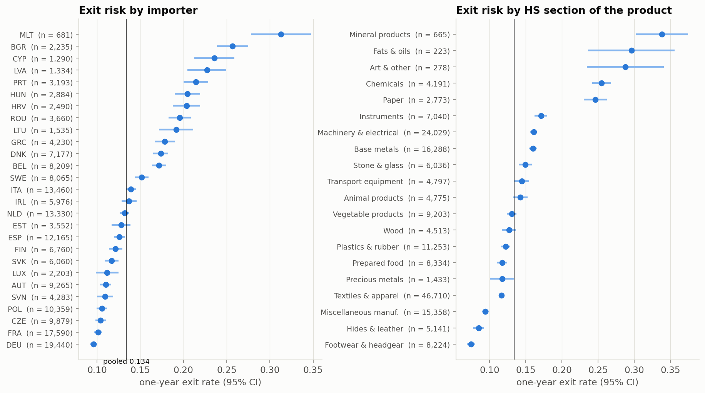 | Exit rate by importer and by HS section | Large markets are stable (DEU 0.096, FRA ≈ 0.10); small markets are volatile (MLT 0.31, BGR ≈ 0.26). By product, footwear and leather are the most durable (0.07–0.08); minerals, chemicals and paper the least (0.25–0.34). |
| 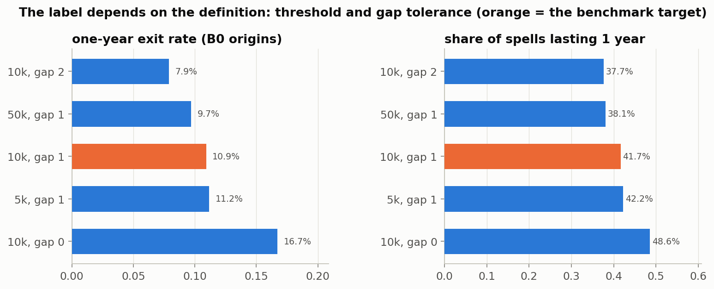 | Exit rate under other threshold/gap definitions | The label itself depends on the definition. Gap 0 → 16.7%; gap 1 (benchmark) → 10.9%; gap 2 → 7.9% one-year exit rate on B0. The threshold matters much less (5k: 11.2%, 50k: 9.7%). |

---

## Part 3 — Initial results (Đợt 2, test origins 2019–2021)

Test scores come from `reports/batch2/cells.csv`. Stochastic models (Boosted
hazard, MLP, RSF, DeepSurv, CoxTime, DeepHit) are the mean over refit seeds 1–3.
Full tables with every secondary metric per fold:

- `out/tables/results_D_per_fold.csv`: Brier, log-loss, ROC/PR-AUC, calibration.
- `out/tables/results_L_per_fold.csv`: IBS, Brier@1/2/3, Antolini C_td, td-AUC,
  KM vs mean predicted S.
- `out/tables/results_per_fold.md`: ready to paste, sets S1/S4/S6.

### 3.1 Per-fold scores (set S6 = S★)

**Task D: Brier score at 1 year (lower is better)**

| Model | F1 (2019) | F2 (2020) | F3 (2021) | Mean | Skill vs age-only |
|---|---:|---:|---:|---:|---:|
| MLP hazard | **0.07846** | **0.07016** | 0.07330 | **0.07397** | 0.106 |
| Flexible cloglog | 0.07868 | 0.07062 | **0.07322** | 0.07418 | 0.103 |
| Boosted hazard | 0.07860 | 0.07047 | 0.07388 | 0.07432 | 0.101 |
| Cloglog | 0.07899 | 0.07105 | 0.07332 | 0.07445 | 0.099 |
| *Age-only (ref.)* | 0.08592 | 0.07749 | 0.08473 | 0.08272 | 0 |

**Task L: IPCW integrated Brier score, 1–3 years (lower is better)**

| Model | F1 (2019) | F2 (2020) | F3 (2021) | Mean | Skill vs KM |
|---|---:|---:|---:|---:|---:|
| DeepHit | **0.09448** | **0.08778** | **0.09316** | **0.09181** | 0.298 |
| RSF | 0.09479 | 0.08849 | 0.09441 | 0.09256 | 0.292 |
| DeepSurv | 0.09585 | 0.08835 | 0.09575 | 0.09332 | 0.286 |
| CoxTime | 0.09693 | 0.08903 | 0.09571 | 0.09389 | 0.282 |
| CoxNet | 0.09791 | 0.08900 | 0.09555 | 0.09415 | 0.280 |
| *Kaplan–Meier (ref.)* | 0.13566 | 0.12354 | 0.13317 | 0.13079 | 0 |

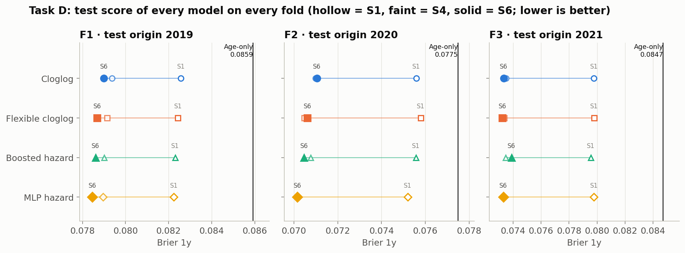
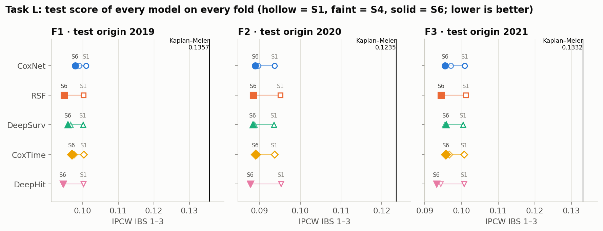

In both figures, each row is a model. Hollow, faint and solid markers are S1, S4
and S6. The long S1 → S4/S6 jump next to the tight spread between models is the
main finding: **feature representation moves the score far more than
architecture**. The ordering is stable across folds for Task L (DeepHit first in
all three). For Task D, the top four are within 0.0005 of each other and trade
places between folds.

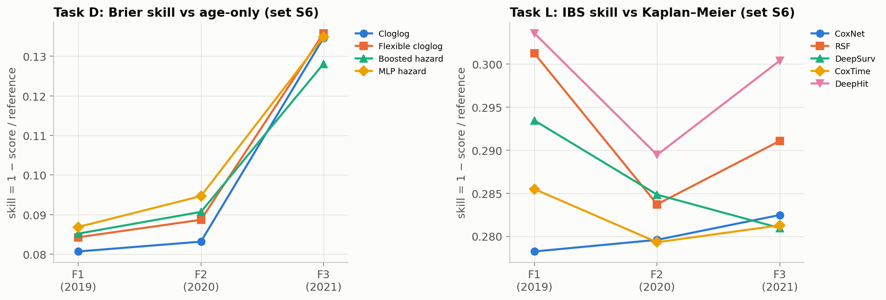

Skill varies by fold mainly because the reference varies. For example, 2021 has a
hard age-only baseline, so Task D skill is 0.13–0.14 in F3 against 0.08–0.09 in F1.
Compare models within a fold, not across folds.

### 3.2 Survival curves

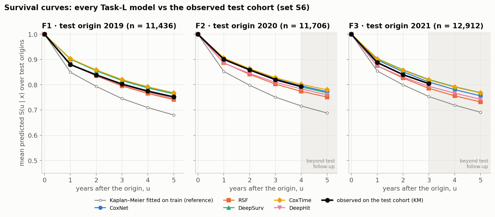

Each coloured line is a model's predicted S(u | x), averaged over all test
origins of the fold. The black line is the Kaplan–Meier curve observed on that
same cohort, available to u = 5, 4 and 3 in F1, F2 and F3; the grey area has no
follow-up yet.

- All five models sit within ±2 percentage points of the observed curve.
- The **Kaplan–Meier reference** is 3–8 pp too low, and the gap widens with u. It
  learns the exit rate of 2005–2016, which was higher than in 2019–2021
  (Part 2, calendar figure). This drift, not a lack of ranking, is the main reason
  the models' IBS is about 30% lower than the reference's.

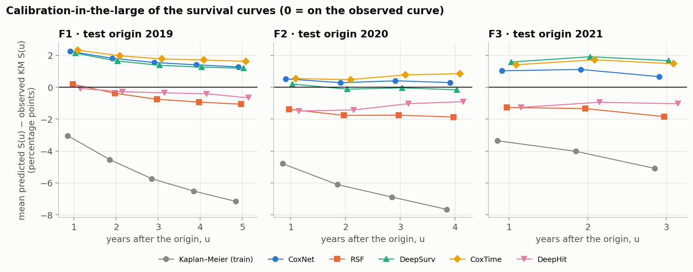

The same comparison as a gap (predicted − observed, in pp) makes the model
differences visible:

- The partial-likelihood models (CoxNet, DeepSurv, CoxTime) are **too optimistic
  by 1–2 pp** in F1 and F3.
- RSF and DeepHit are closest in F1 and slightly pessimistic in F2/F3.
- C-index is almost identical across models (0.850–0.853). The IBS ranking
  therefore comes from this level/time-profile difference, not from ordering.

### 3.3 Hazard curves

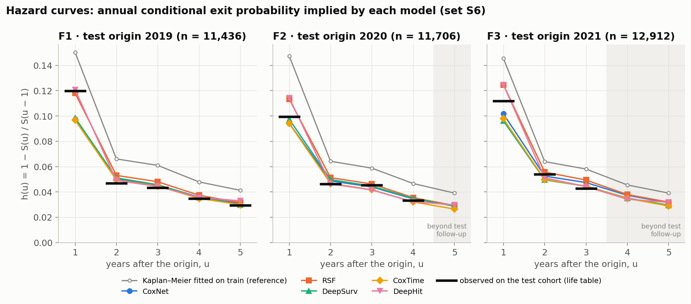

The hazard is h(u) = 1 − S(u)/S(u − 1): the probability of exiting in year u
given survival to u − 1. The observed hazard (black bars) has a pronounced
**first-year spike**, about 0.10–0.12, then flattens near 0.03–0.05.

- **RSF and DeepHit** do not assume proportional hazards, and they reproduce the
  spike: F1 u = 1 is 0.118–0.121 vs 0.120 observed.
- **CoxNet, DeepSurv and CoxTime** under-shoot it (0.097–0.099 in F1) and match
  from u = 2 onward.
- In F2 (origin 2020, a low-exit year), RSF/DeepHit over-shoot instead
  (0.113–0.114 vs 0.099). No model sees the 2020 dip in advance.

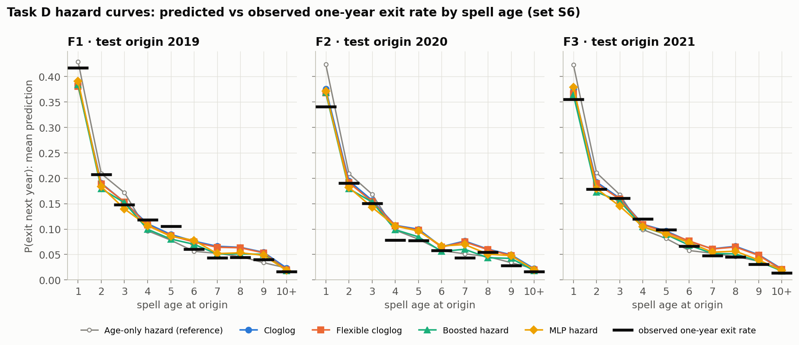

Task D models predict one year only, so their hazard curve is drawn along spell
age. Every model follows the observed age profile. The age-only reference
over-predicts age 1 in F2/F3 (0.42 vs 0.34–0.36). The covariate models pull most
of that back.

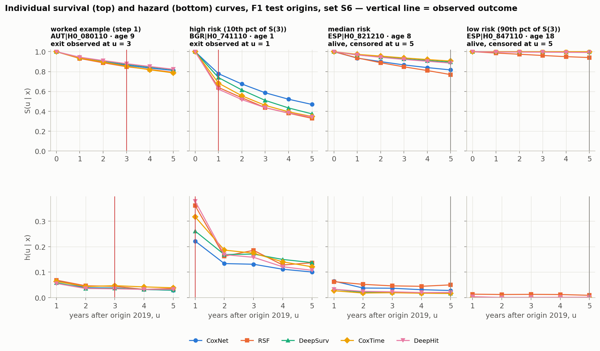

These are individual curves for four F1 test origins: the worked example, and
three relations at the 10th, 50th and 90th percentile of predicted 3-year
survival.

- For the **high-risk** relation (BGR, age 1, observed exit at u = 1), the models
  disagree most. CoxNet gives the lowest first-year hazard (0.22) and DeepHit the
  highest (0.38). The spread shrinks for low-risk relations.
- **Shape:** CoxNet and DeepSurv hazards are smooth scalings of one baseline (PH).
  RSF, DeepHit and CoxTime can bend differently per relation (non-PH).

The numbers behind every curve are in `curves_L_cohort_S6.csv`,
`curves_L_individual_F1.csv` and `curves_D_hazard_by_age_S6.csv`.

---

## Caveats to state when presenting

- These are **temporal confirmation** results on test origins 2019–2021, not the
  final external validation. The 2023 fold, C11 (generalisation) and C12
  (equal-budget/calibration) have not been run.
- Cohort curves are population averages. A model can match the average curve and
  still rank relations poorly; that is what C_td/td-AUC in
  `results_L_per_fold.csv` check.
- Differences between the top models are small. The paired relation-bootstrap
  confidence intervals are in `reports/batch2/REPORT.md` and should be quoted with
  any ranking.
- Descriptive plots in Part 2 show associations, not causal effects.
